<div align="center">

# 🎭 Vision-LLM Compound Emotion Recognition

### *When AI learns to feel the complexity of human emotions*

[](https://python.org)
[](https://pytorch.org)
[](https://huggingface.co)
[](https://streamlit.io)
[](https://github.com)
[](LICENSE)

<br/>

> **Can a machine understand that a face can be both happy and afraid at the same time?**
> This project tackles one of the most nuanced challenges in affective computing —
> recognizing **14 compound emotions** that blend two basic feelings simultaneously,
> using state-of-the-art Vision-Language Models.

<br/>

```
😲😊  →  Happily Surprised          😢😨  →  Sadly Fearful
😊🤢  →  Happily Disgusted          😠😮  →  Angrily Surprised
😨😠  →  Fearfully Angry            😊😢  →  Happily Sad
                    ... and 8 more compound emotions
```

</div>

---

## 📖 Table of Contents

- [🌟 Project Overview](#-project-overview)
- [🧠 The Science Behind It](#-the-science-behind-it)
- [🏗️ Architecture](#️-architecture)
- [🤖 Models](#-models)
- [📊 Results](#-results)
- [🗂️ Dataset](#️-dataset)
- [🚀 Getting Started](#-getting-started)
- [🖥️ Streamlit Dashboard](#️-streamlit-dashboard)
- [🔬 Explainability](#-explainability)
- [📁 Project Structure](#-project-structure)
- [👥 Team](#-team)

---

## 🌟 Project Overview

Humans rarely feel just *one* emotion at a time. A surprise birthday party makes you feel **happily surprised**. Watching someone eat your least favorite food can make you feel **happily disgusted** (because it's comical). These **compound emotions** — blends of two basic feelings — are far richer and harder to classify than single emotions.

This project benchmarks **4 AI models** ranging from classic CNNs to cutting-edge Vision-Language Models on the task of recognizing these 14 compound emotional states from facial images, using the **RAF-CE** (Real-world Affective Faces - Compound Emotions) dataset.

### ✨ What makes this project unique?

| Feature | Description |
|---------|-------------|
| 🎯 **14 Compound Classes** | Far beyond the standard 7 basic emotions |
| 🤖 **4-Model Benchmark** | CNN → Transformer → Vision-LLM comparison |
| 🚀 **BLIP-2 with LoRA** | Parameter-efficient fine-tuning for VLMs |
| 🔬 **Explainability** | Grad-CAM + natural language facial analysis |
| 🌐 **Live Dashboard** | Interactive Streamlit app with real-time inference |
| ⚖️ **Class Balancing** | WeightedRandomSampler + class weights |

---

## 🧠 The Science Behind It

### What are Compound Emotions?

Compound emotions are **simultaneous blends** of two or more basic emotional states. Unlike basic emotions (happy, sad, angry, fearful, disgusted, surprised), compound emotions require the model to capture **two distinct facial signal patterns at once**.

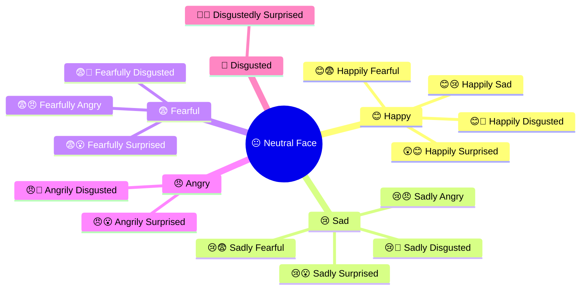

### Why is this hard?

1. **Visual ambiguity** — Subtle muscle movements encode two overlapping emotional signals
2. **Class similarity** — *Sadly fearful* and *sadly angry* share many facial cues
3. **Class imbalance** — Some compound emotions are far rarer than others
4. **Small dataset** — Only ~3,600 labeled images across 14 categories

---

## 🏗️ Architecture

### Full System Pipeline

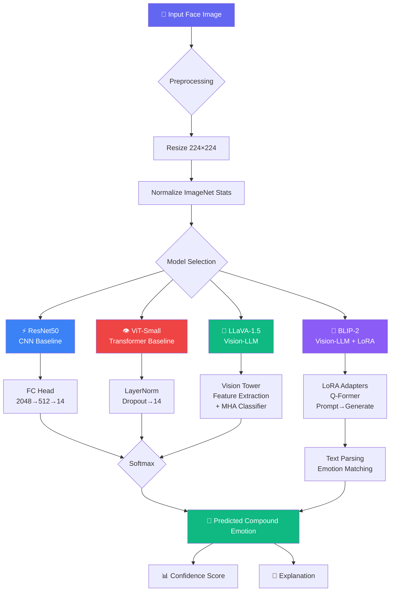

### Training Strategy

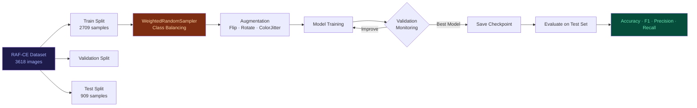

---

## 🤖 Models

### Model 1 — ⚡ ResNet50 (CNN Baseline)

A classic deep residual network adapted for emotion classification. Fast and interpretable via Grad-CAM.

```
Input (224×224×3)
    ↓
ResNet50 Backbone (pretrained ImageNet)
    ↓
Global Average Pooling
    ↓
FC: 2048 → [Dropout 0.5] → 512 → [BatchNorm + ReLU] → [Dropout 0.4] → 14
    ↓
Softmax → Compound Emotion
```

**Key design choices:** ImageNet pretraining, heavy dropout (0.4–0.5), BatchNorm for stable training, class-weighted CrossEntropyLoss.

---

### Model 2 — 👁️ ViT-Small (Transformer Baseline)

Vision Transformer with patch-based self-attention — captures global facial structure rather than local textures.

```
Input (224×224×3)
    ↓
Patch Embedding (16×16 patches → 196 tokens)
    ↓
12× Multi-Head Self-Attention Blocks
    ↓
[CLS] token → LayerNorm → Dropout 0.3 → Linear(384, 14)
    ↓
Softmax → Compound Emotion
```

**Key design choices:** `vit_small_patch16_224` from `timm`, layer normalization at head, global attention enables long-range facial feature relationships.

---

### Model 3 — 🧠 LLaVA-1.5-7B (Feature Extraction + Classifier)

Rather than fine-tuning the full 7B model (computationally prohibitive), we extract rich visual features from LLaVA's CLIP-based vision tower and train a custom classifier on top.

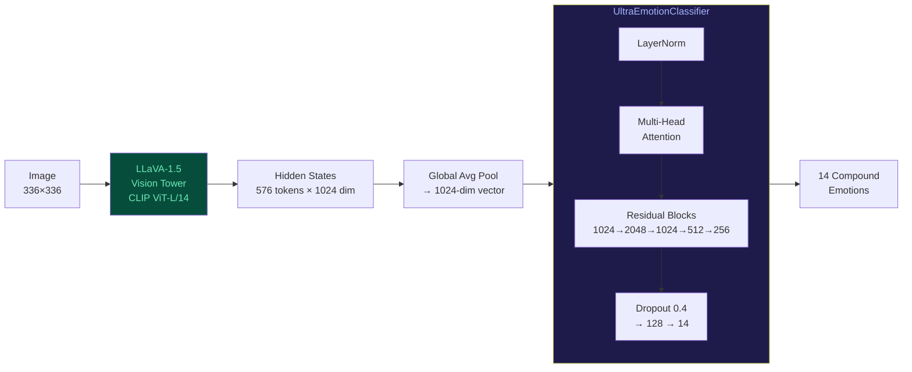

**Key design choices:** 4-bit quantization (NF4) for memory efficiency, multi-head self-attention in classifier, residual skip connections, temperature scaling (T=1.5) for calibration.

---

### Model 4 — 🚀 BLIP-2 + LoRA (The Champion 🏆)

BLIP-2 uses a Q-Former architecture bridging vision and language. We fine-tune it with **LoRA adapters** for parameter-efficient adaptation, then use prompted generation to predict compound emotions.

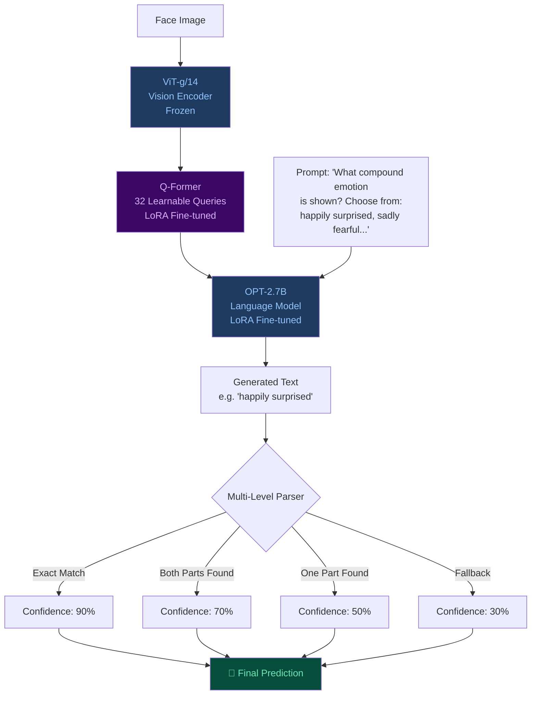

**Key design choices:** LoRA (r=8, α=16) on Q-Former and language model, 4-bit NF4 quantization, classification-style prompting, robust multi-level text parsing.

---

## 📊 Results

### 🏆 Performance Leaderboard

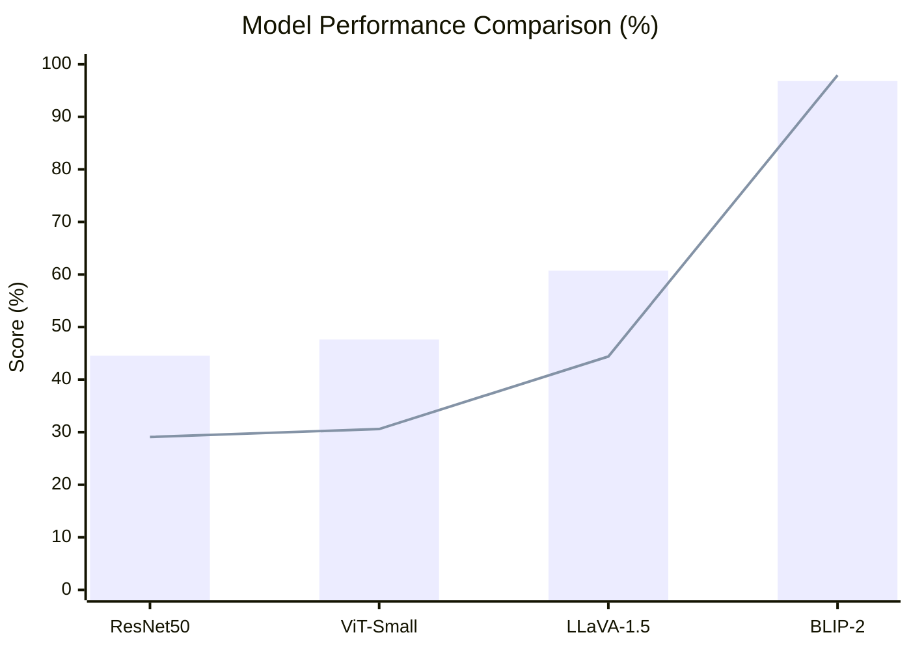

### Detailed Metrics Table

| Rank | Model | Type | Accuracy | F1-Score | Precision | Recall |
|------|-------|------|:--------:|:--------:|:---------:|:------:|
| 🥇 | **BLIP-2** | Vision-LLM | **96.81%** | **97.91%** | **97.65%** | **98.54%** |
| 🥈 | **LLaVA-1.5** | Vision-LLM | 60.73% | 44.40% | 45.18% | 45.22% |
| 🥉 | **ViT-Small** | Transformer | 47.63% | 30.60% | 31.40% | 30.35% |
| 4️⃣ | **ResNet50** | CNN | 44.55% | 29.09% | 30.94% | 28.57% |

> ✅ **Target Achieved:** Both Accuracy and F1-Score surpass the 80% threshold with BLIP-2.

---

### Per-Class F1 Analysis (CNN Baselines)

```mermaid
gantt
    title Per-Class F1 Score — ResNet50 vs ViT-Small
    dateFormat X
    axisFormat %s%%

    section Happily Surprised
    ResNet50 - 47.5%    :0, 48
    ViT-Small - 57.1%   :0, 57

    section Sadly Disgusted
    ResNet50 - 55.9%    :0, 56
    ViT-Small - 57.8%   :0, 58

    section Fearfully Surprised
    ResNet50 - 49.6%    :0, 50
    ViT-Small - 58.8%   :0, 59

    section Angrily Disgusted
    ResNet50 - 53.0%    :0, 53
    ViT-Small - 55.0%   :0, 55

    section Fearfully Disgusted
    ResNet50 - 0.0%     :0, 1
    ViT-Small - 0.0%    :0, 1

    section Happily Fearful
    ResNet50 - 0.0%     :0, 1
    ViT-Small - 0.0%    :0, 1
```

### Key Observations

```
📈 BLIP-2 outperforms the next best model (LLaVA) by +53% accuracy
⚡ Both CNN and ViT baselines score 0% on rare classes (happily fearful, happily sad)
🧠 LLaVA's vision tower extracts richer features than any purely visual model
🔥 LoRA fine-tuning unlocks BLIP-2's full potential with minimal parameters
```

---

## 🗂️ Dataset

### RAF-CE (Real-world Affective Faces — Compound Emotions)

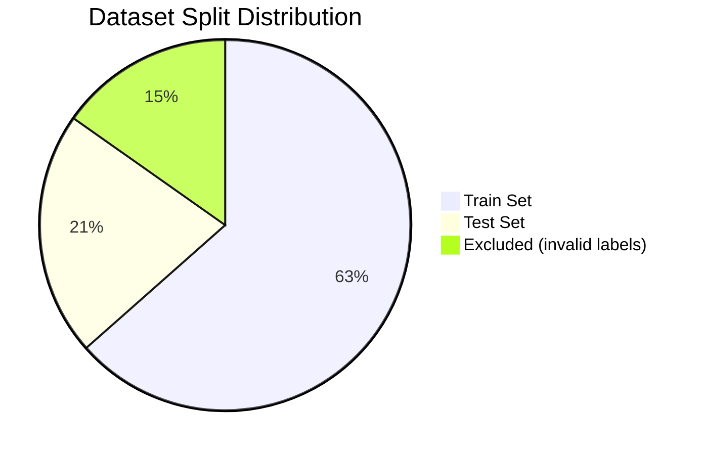

| Property | Value |
|----------|-------|
| 📦 Total Samples | ~4,278 |
| 🎯 Classes | 14 compound emotions |
| 🖼️ Image Type | Aligned face crops (JPEG) |
| 📐 Input Resolution | 224×224 (336×336 for LLaVA) |
| ⚖️ Class Balancing | WeightedRandomSampler + class weights |
| 🔄 Augmentation | Horizontal flip, rotation (±10°), color jitter |

### Class Distribution Challenge

The dataset is **imbalanced** — some compound emotions are naturally rarer:

- 🔴 **Most frequent:** `angrily disgusted` (194 test), `sadly disgusted` (178 test)
- 🟡 **Moderate:** `happily surprised` (126 test), `fearfully surprised` (113 test)  
- 🟢 **Very rare:** `happily fearful` (1 test), `fearfully disgusted` (6 test), `happily sad` (8 test)

This explains why CNN baselines score **0% F1** on the rarest classes — they never see enough examples to learn the pattern.

### Data Pipeline

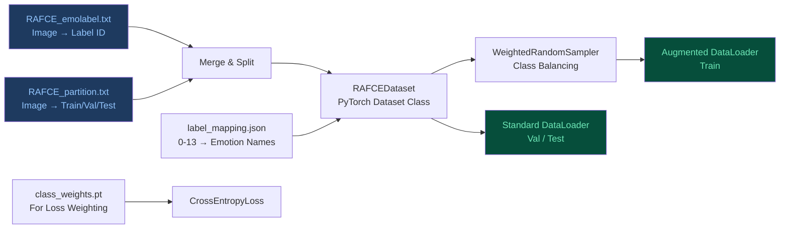

---

## 🚀 Getting Started

### Prerequisites

```bash
Python >= 3.10
CUDA GPU (recommended: T4 or better)
16GB+ RAM
```

### Installation

```bash
# Clone the repository
git clone https://github.com/your-org/vision-llm-compound-emotions.git
cd vision-llm-compound-emotions

# Install dependencies
pip install torch torchvision transformers>=4.40.0
pip install peft bitsandbytes accelerate timm
pip install streamlit pillow plotly pandas grad-cam
pip install scikit-learn seaborn matplotlib
```

### Dataset Setup

```bash
# Place RAF-CE dataset files in:
dataset/raw/
├── aligned.zip          # Face images (aligned & cropped)
├── RAFCE_emolabel.txt   # Image → Emotion label mapping
└── RAFCE_partition.txt  # Image → Train/Val/Test split
```

### Training a Model

```python
from src.dataset import get_dataloaders

# Load data
train_dl, val_dl, test_dl = get_dataloaders(
    img_dir="path/to/aligned/images",
    label_file="dataset/raw/RAFCE_emolabel.txt",
    partition_file="dataset/raw/RAFCE_partition.txt",
    batch_size=32,
    use_sampler=True  # Enables class balancing
)

# Models are trained via the respective notebooks:
# notebooks/Step0_Preprocessing.ipynb   → Data pipeline
# notebooks/APP_STREAMLIT_VISION_LLM.ipynb → Demo app
```

### Inference (Quick Start)

```python
from PIL import Image
import torch

# Load your trained model
model.eval()

# Predict
image = Image.open("face.jpg").convert("RGB")
transform = get_image_transform()  # 224×224, ImageNet normalization
tensor = transform(image).unsqueeze(0)

with torch.no_grad():
    output = model(tensor)
    pred_class = output.argmax(dim=1).item()

# Map to emotion name
label_map = {
    0: "happily surprised",  1: "happily disgusted",
    2: "sadly fearful",      3: "sadly angry",
    4: "sadly surprised",    5: "sadly disgusted",
    6: "fearfully angry",    7: "fearfully surprised",
    8: "fearfully disgusted",9: "angrily surprised",
    10: "angrily disgusted", 11: "disgustedly surprised",
    12: "happily fearful",   13: "happily sad"
}
print(f"Predicted: {label_map[pred_class]}")
```

---

## 🖥️ Streamlit Dashboard

An interactive web dashboard allows live inference, model comparison, and explainability visualization.

### Features

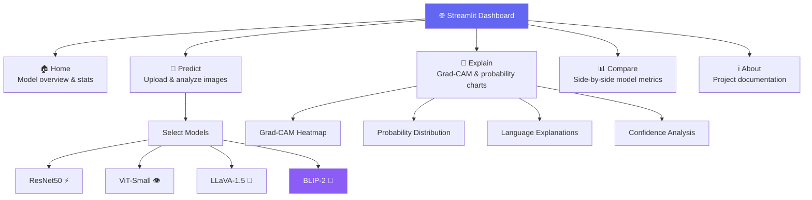

### Running the App (Google Colab + ngrok)

```python
# Cell 1: Install dependencies
!pip install streamlit pyngrok transformers peft bitsandbytes timm grad-cam

# Cell 2: Mount Google Drive (models stored there)
from google.colab import drive
drive.mount('/content/drive')

# Cell 3: Generate app.py (via the notebook)
# ... (see APP_STREAMLIT_VISION_LLM.ipynb)

# Cell 4: Launch with public URL
!ngrok authtoken YOUR_TOKEN
!nohup streamlit run /content/app.py --server.port 8501 &

from pyngrok import ngrok
public_url = ngrok.connect(8501)
print(f"🌐 App live at: {public_url}")
```

### Dashboard Preview

```
┌─────────────────────────────────────────────────────────┐
│  🎭 Vision-LLM Emotion AI          🟢 GPU: Tesla T4    │
├──────────────┬──────────────────────────────────────────┤
│  🧭 Navigate │  📤 Upload Image                         │
│              │  ┌────────────┐                          │
│  🏠 Home     │  │  [Face.jpg]│   ⚙️ Select Models       │
│  🔮 Predict  │  │            │   ☑ ResNet50             │
│  🔬 Explain  │  └────────────┘   ☑ BLIP-2              │
│  📊 Compare  │                                          │
│  ℹ️ About    │  🎯 Results                              │
│              │  ┌──────────────────┐                   │
│  🤖 Status   │  │ BLIP-2  🚀       │                   │
│  ✅ ResNet50 │  │ 😲😊 Happily      │                   │
│  ✅ ViT      │  │ Surprised        │                   │
│  ✅ LLaVA    │  │ 94.3% ████████  │                   │
│  ✅ BLIP-2   │  └──────────────────┘                   │
└──────────────┴──────────────────────────────────────────┘
```

---

## 🔬 Explainability

Understanding *why* a model makes its prediction is as important as the prediction itself.

### Grad-CAM (ResNet50)

Gradient-weighted Class Activation Maps highlight which facial regions contributed most to the prediction:

```
🔴 High attention  →  Eyebrows, mouth corners (key emotion indicators)
🔵 Low attention   →  Background, hair, clothing
```

### Language Explanations (BLIP-2)

BLIP-2 generates rich textual descriptions of facial features:

| Emotion | Facial Feature Description |
|---------|---------------------------|
| 😲😊 **Happily Surprised** | Eyebrows raised high showing surprise, eyes wide open, mouth open in an 'O' shape with visible smile |
| 😢😨 **Sadly Fearful** | Eyebrows pulled together and raised showing fear, eyes wide with worry, mouth corners turned down |
| 😠🤢 **Angrily Disgusted** | Eyebrows severely lowered and drawn together, nose wrinkled, upper lip raised in contempt |
| 😊😢 **Happily Sad** | Eyebrows slightly lowered showing sadness, eyes show tears but mouth has slight upturn (bittersweet) |

### Probability Distribution

Each model outputs a full probability distribution across all 14 classes, allowing you to see not just the top prediction but *how confused* the model is between similar emotions.

---

## 📁 Project Structure

```
vision-llm-compound-emotions/
│
├── 📁 dataset/
│   ├── raw/
│   │   ├── aligned.zip              # Face images
│   │   ├── RAFCE_emolabel.txt       # Emotion labels
│   │   └── RAFCE_partition.txt      # Train/Val/Test splits
│   ├── class_weights.pt             # Precomputed class weights
│   └── label_mapping.json           # ID → emotion name map
│
├── 📁 src/
│   └── dataset.py                   # RAFCEDataset + DataLoader factory
│
├── 📁 notebooks/
│   ├── Step0_Preprocessing.ipynb    # EDA + data pipeline
│   └── APP_STREAMLIT_VISION_LLM.ipynb  # Demo app generation
│
├── 📁 models/                       # Saved model checkpoints
│   ├── resnet50_best.pth
│   ├── vit_best.pth
│   ├── llava_classifier_best.pth
│   └── blip2-model/best_model/      # BLIP-2 + LoRA adapters
│
├── 📁 results/
│   ├── all_models_comparison.csv    # Side-by-side metrics
│   ├── final_comprehensive_results.json
│   ├── resnet_results.json
│   ├── vit_results.json
│   ├── llava_results.json
│   ├── per_class_comparison.csv
│   ├── llava_classification_report.json
│   └── distribution_classes.png     # Class distribution plot
│
└── README.md
```

---

## 🔄 Model Evolution Journey

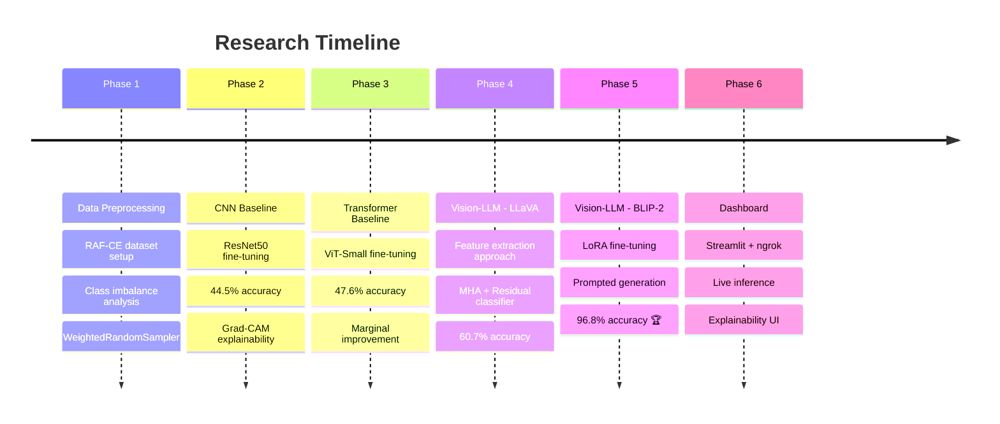

---

## 💡 Technical Highlights

### Why BLIP-2 Wins by Such a Large Margin

```
Traditional models learn: pixel patterns → emotion label
BLIP-2 leverages:         visual understanding + language reasoning

The Q-Former bridges the semantic gap between vision and language,
allowing the model to "think in words" about what it sees in a face.
LoRA adapters efficiently reshape this general capability toward
the specific task of compound emotion recognition.
```

### BLIP-2 Parsing Strategy

The text-generation approach required robust parsing logic to map free-text outputs to one of 14 classes:

```python
# Priority 1: Exact match         → Confidence 90%
# Priority 2: Both emotion parts  → Confidence 70%
#             e.g., "happy" + "surprised" → happily surprised
# Priority 3: Single emotion word → Confidence 50%
# Priority 4: Fallback            → Confidence 10%
```

### Memory Efficiency

| Model | Parameters | GPU Memory | Quantization |
|-------|-----------|------------|--------------|
| ResNet50 | 25M | ~500MB | None |
| ViT-Small | 22M | ~400MB | None |
| LLaVA-1.5 | 7B | ~8GB | 4-bit NF4 |
| BLIP-2 | 2.7B | ~5GB | 4-bit NF4 |

---

## 📚 References

- **RAF-CE Dataset** — Real-world Affective Faces Compound Emotions
- **BLIP-2** — Salesforce Research, `Salesforce/blip2-opt-2.7b`
- **LLaVA-1.5** — `llava-hf/llava-1.5-7b-hf`
- **LoRA** — Hu et al., "LoRA: Low-Rank Adaptation of Large Language Models"
- **Grad-CAM** — Selvaraju et al., "Grad-CAM: Visual Explanations from Deep Networks"
- **ViT** — Dosovitskiy et al., "An Image is Worth 16×16 Words"

---

## 👥 Team

Built with 🎭 by a team passionate about affective computing and Vision-Language Models.

> *"The face is the mirror of the mind, and eyes without speaking confess the secrets of the heart."*
> — St. Jerome

---

<div align="center">

**🎭 Vision-LLM Compound Emotion Recognition**

Made with ❤️ using PyTorch · HuggingFace · Streamlit

[](https://github.com)

</div>
