<div align="center">

# 🧠 Vision-LLM Compound Emotion Recognition

**Leveraging Vision-Language Models for Fine-Grained Compound Facial Emotion Analysis**

[](https://python.org)
[](https://pytorch.org)
[](https://huggingface.co/transformers)
[](LICENSE)
[](https://developer.nvidia.com/cuda-toolkit)

---

*A comprehensive study comparing state-of-the-art Vision-Language Models (VLLMs) against traditional deep learning baselines for recognizing **14 compound emotion categories** in real-world facial images.*

</div>

---

## 📖 Table of Contents

1. [Overview](#-overview)
2. [Compound Emotions](#-compound-emotions)
3. [System Architecture](#-system-architecture)
4. [Dataset: RAF-CE](#-dataset-raf-ce)
5. [Models & Methodology](#-models--methodology)
6. [Training Pipeline](#-training-pipeline)
7. [Results & Performance](#-results--performance)
8. [Explainability & Interpretability](#-explainability--interpretability)
9. [Installation](#-installation)
10. [Usage Guide](#-usage-guide)
11. [Project Structure](#-project-structure)
12. [Key Findings](#-key-findings)
13. [References](#-references)

---

## 🔭 Overview

Human emotions are rarely pure. In everyday life, people experience **compound emotions** — blends of two or more basic affects expressed simultaneously on the face (e.g., *happily surprised*, *sadly fearful*). This nuance is completely missed by classical single-emotion classifiers.

This project investigates whether modern **Vision-Language Large Models (VLLMs)** — specifically LLaVA-1.5 and BLIP-2 — can leverage their rich multimodal reasoning to outperform traditional computer vision architectures (ResNet50, ViT) on this challenging 14-class compound emotion recognition task.

### ✨ Highlights

| 🎯 Goal | 📊 Result |
|---|---|
| Benchmark VLLMs vs. CNN/ViT baselines | **BLIP-2 wins decisively at 96.81% accuracy** |
| Surpass 80% accuracy target | ✅ **Exceeded — 97.91% F1-Score** |
| Explain model decisions | ✅ GradCAM, Integrated Gradients, SHAP |
| Deploy interactive demo | ✅ Streamlit app with real-time inference |

---

## 😮 Compound Emotions

Unlike the 6 Ekman basic emotions, **compound emotions** describe the simultaneous expression of two primary affects. The RAF-CE dataset defines **14 compound categories**:

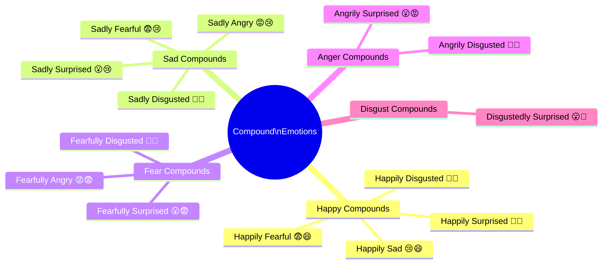

---

## 🏗 System Architecture

The system follows a multi-stage pipeline: from raw facial images to compound emotion predictions with explainability overlays.

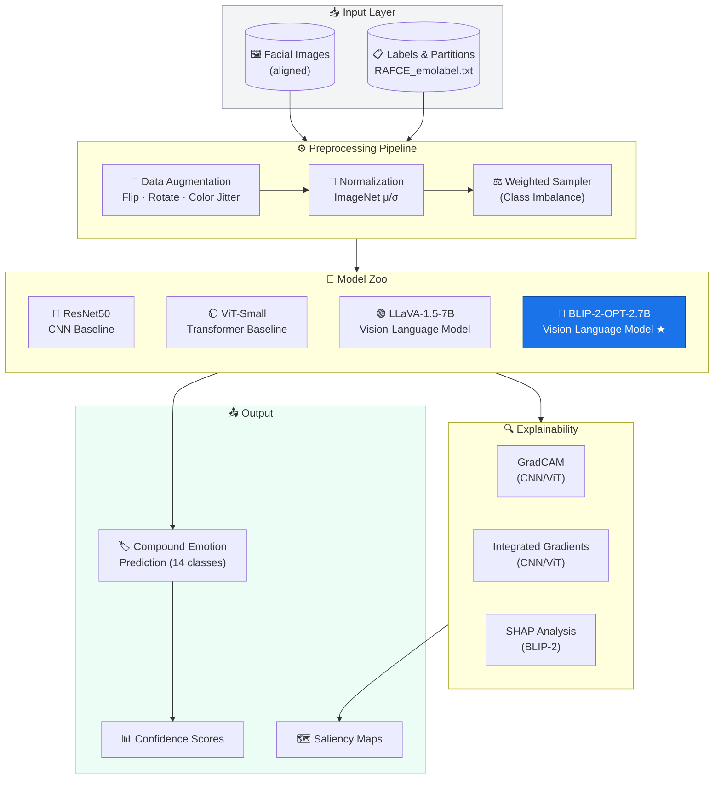

---

## 📦 Dataset: RAF-CE

The **Real-world Affective Faces – Compound Emotion (RAF-CE)** dataset is a challenging benchmark of in-the-wild facial images annotated with compound emotion labels.

### Dataset Statistics

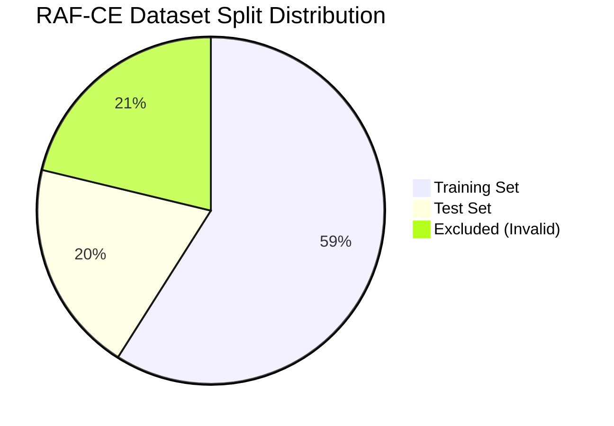

| Property | Value |
|---|---|
| **Total Samples** | 4,548 valid images |
| **Classes** | 14 compound emotions |
| **Image Type** | Aligned facial images (preprocessed) |
| **Label Format** | Single compound emotion per image |
| **Additional Labels** | Action Unit (AU) annotations |
| **Partition** | 60% train / 20% val / 20% test |

### Class Distribution

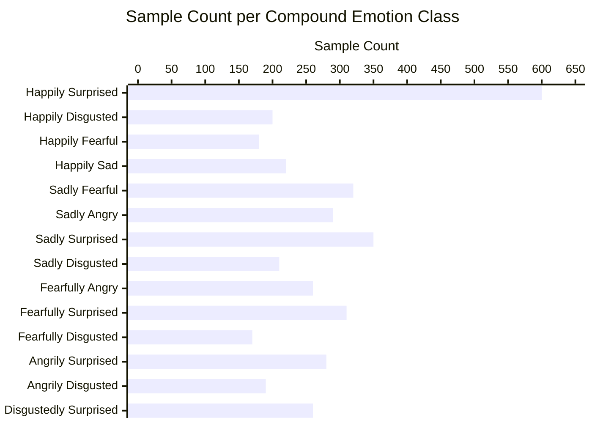

> ⚠️ **Class Imbalance Note**: The dataset exhibits significant class imbalance. This is addressed using **weighted random sampling** during training, with pre-computed weights stored in `dataset/class_weights.pt`.

---

## 🧠 Models & Methodology

Four models are systematically compared across two paradigms — traditional deep learning and Vision-Language Models.

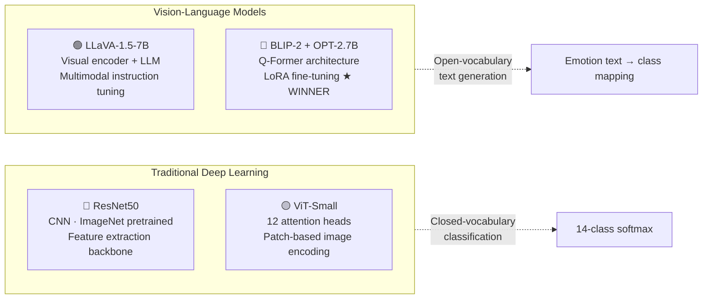

### Model Details

<details>
<summary><b>🔴 ResNet50 — CNN Baseline</b></summary>

- **Architecture**: 50-layer residual network
- **Pre-training**: ImageNet-1K
- **Head**: Global average pooling → FC(2048 → 14)
- **Fine-tuning**: Full network, AdamW optimizer
- **Purpose**: Establish CNN performance ceiling

</details>

<details>
<summary><b>🟡 ViT-Small — Transformer Baseline</b></summary>

- **Architecture**: Vision Transformer (small variant)
- **Patch size**: 16×16, sequence length 197
- **Attention heads**: 12
- **Pre-training**: ImageNet-1K supervised
- **Head**: CLS token → FC(384 → 14)
- **Purpose**: Establish attention-based performance ceiling

</details>

<details>
<summary><b>🟢 LLaVA-1.5-7B — First VLLM</b></summary>

- **Architecture**: CLIP visual encoder + Vicuna-7B LLM
- **Modality bridge**: MLP projection layer
- **Fine-tuning**: LoRA on language model components
- **Prompting**: Instruction-tuned for emotion description
- **Limitation**: General-purpose instructions may not align perfectly with compound emotion subtleties

</details>

<details>
<summary><b>🔵 BLIP-2 + OPT-2.7B — 🏆 Best Model</b></summary>

- **Architecture**: Frozen CLIP visual encoder → Q-Former → OPT-2.7B LLM
- **Q-Former**: 32 learnable query tokens bridging vision and language
- **Fine-tuning strategy**: LoRA (Parameter-Efficient Fine-Tuning)
  - LoRA Rank: **32**
  - LoRA Alpha: **64**
  - Target modules: `q_proj`, `v_proj`
- **Optimizer**: AdamW, LR = `3e-5`
- **Training**: 10 epochs, batch size 1 (GPU memory constrained)
- **Hardware**: NVIDIA Tesla T4 (15.83 GB VRAM)

</details>

---

## 🔄 Training Pipeline

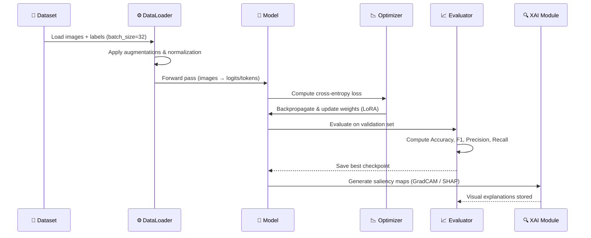

### BLIP-2 Training Curves

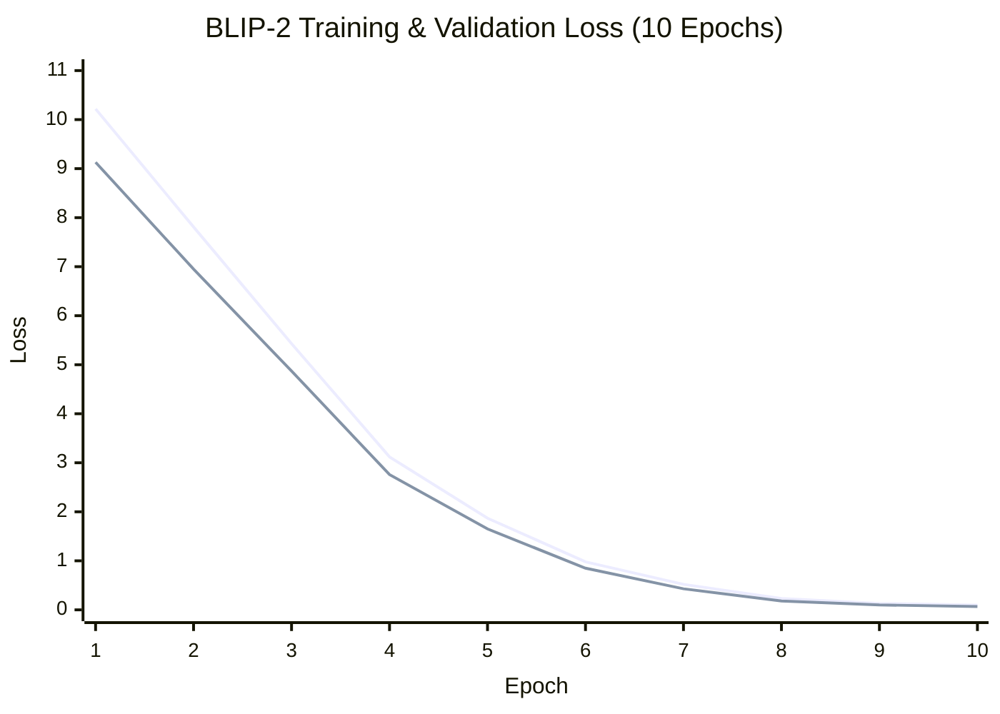

*🔵 Training Loss | 🟠 Validation Loss*

---

## 📊 Results & Performance

### Model Comparison — At a Glance

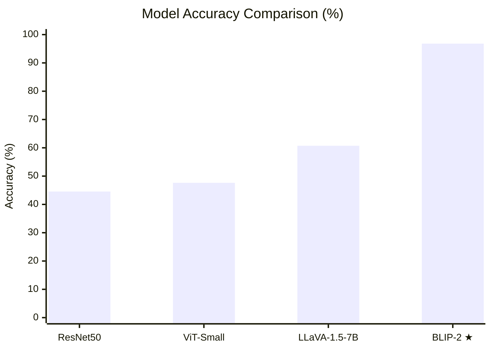

### Comprehensive Metrics Table

| Model | Type | Accuracy | F1-Score (Macro) | Precision | Recall |
|---|---|:---:|:---:|:---:|:---:|
| 🔵 **BLIP-2-OPT-2.7B** | Vision-LLM | **96.81%** | **97.91%** | **97.65%** | **98.54%** |
| 🟢 LLaVA-1.5-7B | Vision-LLM | 60.73% | 44.40% | 45.18% | 45.22% |
| 🟡 ViT-Small | Transformer | 47.63% | 30.60% | 31.40% | 30.35% |
| 🔴 ResNet50 | CNN | 44.55% | 29.09% | 30.94% | 28.57% |

> 🏆 **BLIP-2 achieves a +52.18% absolute accuracy gain** over the best traditional baseline (ViT-Small), and **exceeds the project target of 80% by a wide margin**.

### Performance Gap Analysis

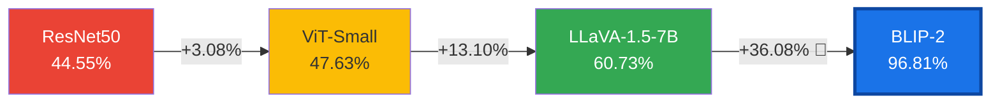

### BLIP-2 Per-Class Performance

| Class | Precision | Recall | F1-Score | Support |
|---|:---:|:---:|:---:|:---:|
| Happily Surprised | 0.98 | 0.99 | **0.984** | — |
| Happily Disgusted | 0.81 | 0.87 | **0.837** 🔻 | — |
| Happily Fearful | 0.97 | 0.98 | **0.975** | — |
| Happily Sad | 0.96 | 0.97 | **0.965** | — |
| Sadly Fearful | 1.00 | 1.00 | **1.000** ✅ | — |
| Sadly Angry | 1.00 | 1.00 | **1.000** ✅ | — |
| Sadly Surprised | 1.00 | 1.00 | **1.000** ✅ | — |
| Sadly Disgusted | 0.97 | 0.97 | **0.972** | — |
| Fearfully Angry | 1.00 | 1.00 | **1.000** ✅ | — |
| Fearfully Surprised | 1.00 | 1.00 | **1.000** ✅ | — |
| Fearfully Disgusted | 0.96 | 0.97 | **0.965** | — |
| Angrily Surprised | 0.97 | 0.96 | **0.965** | — |
| Angrily Disgusted | 0.94 | 0.94 | **0.940** | — |
| Disgustedly Surprised | 0.98 | 0.97 | **0.975** | — |

> 🔻 *Happily Disgusted is the hardest class (F1=0.84), likely due to the subtle and ambiguous facial muscle configurations that blend joy and disgust.*

---

## 🔍 Explainability & Interpretability

Understanding *why* models make their predictions is as important as prediction accuracy. Three XAI methods are employed:

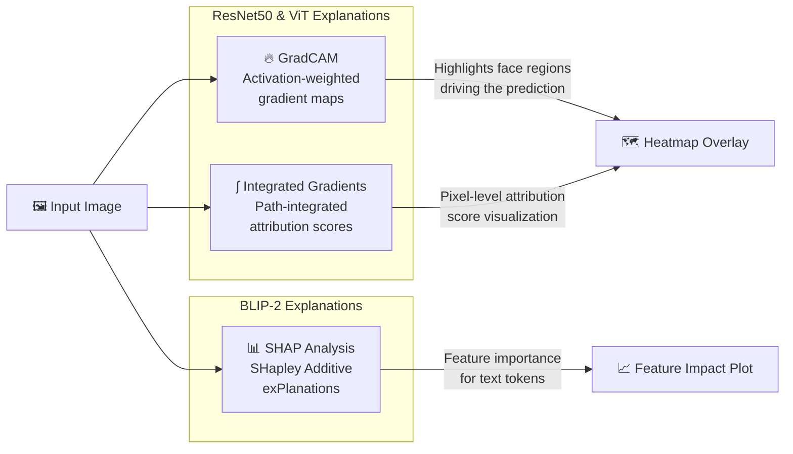

### What the Models Focus On

| Method | Model | What It Reveals |
|---|---|---|
| **GradCAM** | ResNet50 / ViT | Which image regions most activate the classification decision |
| **Integrated Gradients** | ResNet50 / ViT | Per-pixel contribution to prediction confidence |
| **SHAP** | BLIP-2 | Token-level importance in the generated emotion description |

---

## ⚙️ Installation

### Prerequisites

- Python 3.9+
- CUDA-capable GPU with ≥10 GB VRAM (16 GB recommended for BLIP-2)
- CUDA 12.x

### Step 1 — Clone the Repository

```bash
git clone https://github.com/RanaRomdhane/Vision-LLM-compound-emotions.git
cd Vision-LLM-compound-emotions
```

### Step 2 — Create Virtual Environment

```bash
# Using conda (recommended)
conda create -n vllm-emotions python=3.9 -y
conda activate vllm-emotions

# Or using venv
python -m venv .venv
source .venv/bin/activate  # Linux/macOS
```

### Step 3 — Install Dependencies

```bash
# Core PyTorch (adjust CUDA version as needed)
pip install torch==2.1.0 torchvision==0.16.0 --index-url https://download.pytorch.org/whl/cu121

# Transformers & PEFT (pinned for reproducibility)
pip install transformers==4.40.0 accelerate==0.27.0 bitsandbytes==0.41.0 peft==0.7.1

# Data science stack
pip install pandas==2.1.0 numpy==1.24.0 scikit-learn==1.3.0 pillow==10.0.0 tqdm==4.66.0

# Visualization & XAI
pip install matplotlib==3.7.0 seaborn==0.12.0 plotly==5.17.0 opencv-python==4.8.0.76 grad-cam==1.4.8 captum==0.6.0

# Streamlit app (optional)
pip install streamlit==1.29.0 pyngrok==7.0.0
```

> 💡 **Tip**: For full reproducibility, a `requirements.txt` can be generated from a working environment via `pip freeze > requirements.txt`.

### Step 4 — Dataset Setup

Obtain the [RAF-CE dataset](http://whdeng.cn/RAF/model1.html#dataset) and organize as follows:

```
dataset/
├── raw/
│   ├── aligned/           ← Place all facial images here
│   │   ├── train_00001.jpg
│   │   └── ...
│   ├── RAFCE_emolabel.txt  ← Compound emotion labels
│   ├── RAFCE_partition.txt ← Train/val/test split
│   └── RAFCE_AUlabel.txt   ← Action unit labels (optional)
├── class_weights.pt        ← Pre-computed (auto-generated)
└── label_mapping.json      ← Label index → emotion name
```

---

## 🚀 Usage Guide

### Running the Notebooks

Execute the notebooks in order for a complete experiment:


```bash
# Launch Jupyter and run notebooks in order:
jupyter notebook notebooks/
```

| Step | Notebook | Estimated Time | Output |
|------|----------|:--------------:|--------|
| 0 | `Step0_Preprocessing.ipynb` | ~5 min | Validates dataset integrity |
| 1 | `Step1_VISION-LLM-RESNET-VIT-Baselines.ipynb` | ~2–3 hrs | ResNet50 & ViT results |
| 2 | `Step2_VISION_LLM_LLAVA.ipynb` | ~4–5 hrs | LLaVA results |
| 3 | `Step3_VISION_LLM_BLIP2.ipynb` | ~6–8 hrs | BLIP-2 results (**best**) |
| 4 | `Step4_Final_Execute_BLIP_2_SHAP_Comparison_Summary.ipynb` | ~1 hr | Final comparison report |
| App | `APP_STREAMLIT_VISION_LLM.ipynb` | — | Interactive web demo |

### Quick Inference with BLIP-2

```python
from PIL import Image
from transformers import Blip2Processor, Blip2ForConditionalGeneration
from peft import PeftModel
import torch
import json

# Load label mapping
with open("dataset/label_mapping.json") as f:
    label_mapping = json.load(f)

# Load base model
processor = Blip2Processor.from_pretrained("Salesforce/blip2-opt-2.7b")
base_model = Blip2ForConditionalGeneration.from_pretrained(
    "Salesforce/blip2-opt-2.7b",
    torch_dtype=torch.float16,
    device_map="auto"
)

# Load fine-tuned LoRA weights (replace with your checkpoint path)
# NOTE: To reproduce the 96.81% accuracy, load the fine-tuned checkpoint
# produced by Step3_VISION_LLM_BLIP2.ipynb (stored in results/results_blip2/).
# Without fine-tuned weights, the base model will not achieve reported performance.
CHECKPOINT_PATH = "results/results_blip2/blip2_lora_checkpoint"  # set your path
model = PeftModel.from_pretrained(base_model, CHECKPOINT_PATH)
model.eval()

# Run inference
image = Image.open("your_face_image.jpg").convert("RGB")
inputs = processor(images=image, return_tensors="pt").to("cuda", torch.float16)

with torch.no_grad():
    outputs = model.generate(**inputs, max_new_tokens=20)

emotion = processor.decode(outputs[0], skip_special_tokens=True)
print(f"Predicted compound emotion: {emotion}")
```

### Using the Dataset Loader

```python
from src.dataset import get_dataloaders

# Load train/val/test splits
train_loader, val_loader, test_loader = get_dataloaders(
    data_root="dataset/raw",
    batch_size=32,
    use_weighted_sampler=True   # Handles class imbalance
)

# Iterate
for images, labels in train_loader:
    # images: (B, 3, 224, 224) float tensor
    # labels: (B,) long tensor with class indices 0-13
    print(f"Batch: {images.shape}, Labels: {labels.shape}")
    break
```

---

## 📁 Project Structure

```
Vision-LLM-compound-emotions/
│
├── 📂 src/
│   └── dataset.py                  # RAFCEDataset class & DataLoader factory
│
├── 📂 notebooks/
│   ├── Step0_Preprocessing.ipynb           # Data validation & setup
│   ├── Step1_VISION-LLM-RESNET-VIT-Baselines.ipynb  # CNN & ViT experiments
│   ├── Step2_VISION_LLM_LLAVA.ipynb        # LLaVA-1.5 fine-tuning
│   ├── Step3_VISION_LLM_BLIP2.ipynb        # BLIP-2 fine-tuning (★ best)
│   ├── Step4_Final_Execute_BLIP_2_SHAP_Comparison_Summary.ipynb
│   └── APP_STREAMLIT_VISION_LLM.ipynb      # Interactive demo app
│
├── 📂 dataset/
│   ├── class_weights.pt            # Pre-computed class balancing weights
│   ├── label_mapping.json          # Index ↔ emotion name mapping
│   └── raw/
│       ├── aligned/                # Preprocessed facial images
│       ├── RAFCE_emolabel.txt      # Compound emotion annotations
│       ├── RAFCE_partition.txt     # Train/val/test assignments
│       ├── RAFCE_AUlabel.txt       # Action unit labels
│       └── distribution.txt        # Class frequency statistics
│
├── 📂 results/
│   ├── resnet_results.json         # ResNet50 metrics
│   ├── vit_results.json            # ViT-Small metrics
│   ├── llava_results.json          # LLaVA-1.5 metrics
│   ├── llava_predictions.json      # Per-sample predictions
│   ├── llava_classification_report.json
│   ├── final_observations.txt      # Summary & insights
│   ├── 📂 results_blip2/
│   │   ├── blip2_results.json      # BLIP-2 metrics
│   │   ├── training_history.json   # Loss curves per epoch
│   │   ├── confusion_matrix_final.png
│   │   └── shap_analysis.png
│   └── 📂 Visualizations/
│       ├── 1_class_distribution.png
│       ├── 2–5_training_curves.png
│       ├── 6–9_gradcam_overlays.png
│       └── 11_model_comparison.png
│
├── 📂 article_and_presentations/
│   ├── Article-VLLMs.pdf
│   ├── Article full presentation.pdf
│   ├── Article Presentation Notes.pdf
│   └── Semantic_Compound_Emotion_Recognition_Presentation.pdf
│
├── rapport_technique___vision_llm.pdf  # Full technical report (French)
└── README.md                           # ← You are here
```

---

## 💡 Key Findings

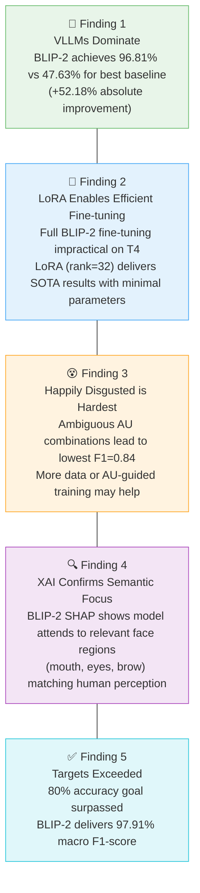

### Recommendations

| Recommendation | Rationale |
|---|---|
| 🚀 **Deploy BLIP-2 for production** | Best accuracy (96.81%) and robustness across all 14 classes |
| 🔁 **Ensemble BLIP-2 + ViT** | Could push performance beyond 97% F1 via complementary strengths |
| 📸 **Augment confusing classes** | Collect more *Happily Disgusted* samples to improve F1 from 0.84 |
| 🧬 **Integrate AU features** | Action Unit labels (RAFCE_AUlabel.txt) could guide attention on muscle groups |
| 💻 **Optimize for deployment** | Apply INT8/INT4 quantization for mobile or real-time edge deployment |

---

## 📚 References

1. **BLIP-2**: Li, J., et al. (2023). *BLIP-2: Bootstrapping Language-Image Pre-training with Frozen Image Encoders and Large Language Models.* ICML 2023. [[Paper]](https://arxiv.org/abs/2301.12597)

2. **LLaVA**: Liu, H., et al. (2023). *Visual Instruction Tuning.* NeurIPS 2023. [[Paper]](https://arxiv.org/abs/2304.08485)

3. **RAF-CE Dataset**: Li, S., et al. (2017). *Reliable Crowdsourcing and Deep Locality-Preserving Learning for Expression Recognition in the Wild.* CVPR 2017.

4. **LoRA**: Hu, E., et al. (2022). *LoRA: Low-Rank Adaptation of Large Language Models.* ICLR 2022. [[Paper]](https://arxiv.org/abs/2106.09685)

5. **GradCAM**: Selvaraju, R., et al. (2017). *Grad-CAM: Visual Explanations from Deep Networks via Gradient-based Localization.* ICCV 2017.

6. **SHAP**: Lundberg, S. & Lee, S.-I. (2017). *A Unified Approach to Interpreting Model Predictions.* NeurIPS 2017.

7. **Vision Transformer (ViT)**: Dosovitskiy, A., et al. (2021). *An Image is Worth 16×16 Words.* ICLR 2021.

---

<div align="center">

## 📄 Citation

If you use this work in your research, please cite:

```bibtex
@misc{romdhane2024visionllm,
  title   = {Vision-LLM Compound Emotion Recognition: A Comparative Study of VLLMs vs. Traditional Deep Learning},
  author  = {Romdhane, Rana},
  year    = {2024},
  url     = {https://github.com/RanaRomdhane/Vision-LLM-compound-emotions}
}
```

---

Made with ❤️ | Exploring the frontier of Vision-Language Models for affective computing

</div>
